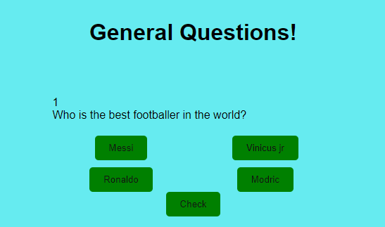

# General Quiz.
 General Quiz is a website that show the practicality of how Javascript can be made interactive. The site will be targeted toward people who loves to test their knowledge by answering different random questions. 
 General quiz is a fully responsive JavaScript question game which will allow users to both test their knowledge by testing how vast the are, and also to have fun.

 ## Features.

 ### Heading
 * This is the part where the user first sees and get the idea of what to expect from the game.
 

 ### Question-area
 * This is the part where all the required questions to be answered are situated. This simple game contains a maximum of four questions where all participants can go through and have fun.

### Options-area
* In the options area, you can find answers to pick from having seen the questions. There are also 4 questions to choose one answer which is the correct one leaving the remaing 3 questions wrong.

### Check
* Having picked the correct answer from the options area, and sure of your answer, you then click on the check button to see your result at the end of the quiz.
