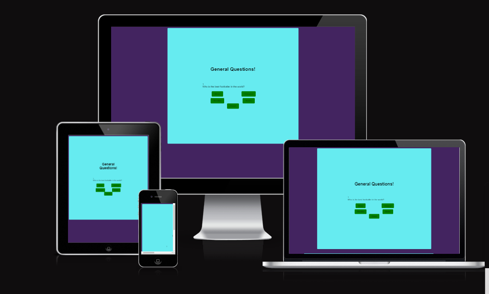
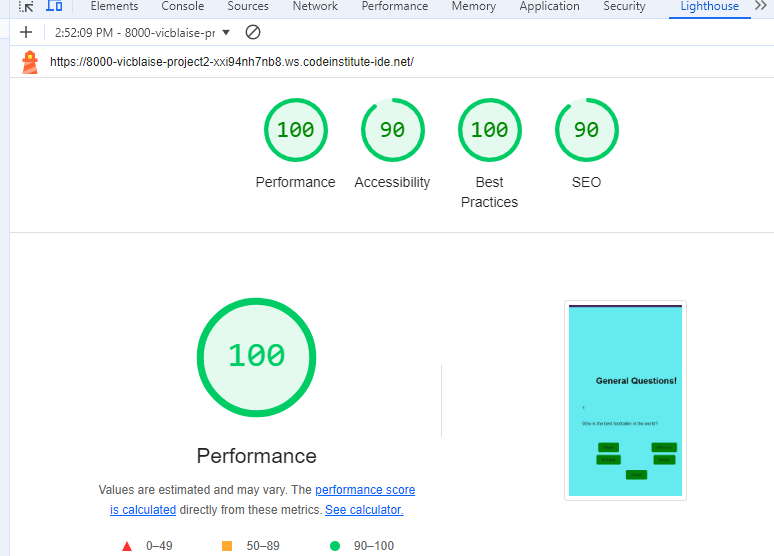

# General Quiz.
 General Quiz is a website that show the practicality of how Javascript can be made interactive. The site will be targeted toward people who loves to test their knowledge by answering different random questions. 
 General quiz is a fully responsive JavaScript question game which will allow users to both test their knowledge by testing how vast the are, and also to have fun.
   

 ## Features.

 ### Heading
 * This is the part where the user first sees and get the idea of what to expect from the game.
 

 ### Question-area
 * This is the part where all the required questions to be answered are situated. This simple game contains a maximum of four questions where all participants can go through and have fun.

### Options-area
* In the options area, you can find answers to pick from having seen the questions. There are also 4 questions to choose one answer which is the correct one leaving the remaing 3 questions wrong.

### Check
* Having picked the correct answer from the options area, and sure of your answer, you then click on the check button to see your result at the end of the quiz.

## Testing.
This project has undergone various testing as well as debugging in other to make sure the site is working very well and without glictch. However, during the course of the testing few issues we found. 
All the steps taken to make sure the site was properly tested and debugged has been enumerated below. Efforts has also been made in trying to fix the few bugs encountered.

### Validator Testing.
* HTML
    - When passed through the official W3C validator no error was returned just a warning message was returned on my [W3C Validator](https://W3C Validator)
* CSS
    - No error was found when passed through the official [Jigsaw Validator](https://jigsawValidator).
* Javascript
    - The following were retured after being passed through the official [jshint validator](https://jshintValidator)
    ° There are four functions in this file
    ° Functions with the largest signature take one argument, while the median is 0.5.
    ° Lagest function has 8 statement in it,while the median is 6.
    ° The most complex statement has a cyclomatic complexity value of 3, while the median is 1.5.

### Deployment.
* The site was deployed to Github pages. 

### Accessibility
* I passed the site through lighthouse in inspect and the result be seen in the screenshoot below.

